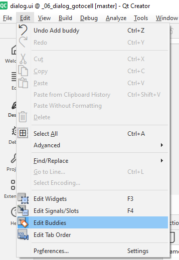
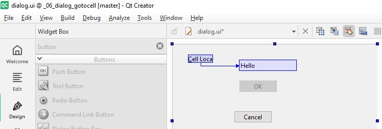

## Content
- [Create UI design file](#create-ui-design-file)
- [Painting Widgets on window of .ui file](#painting-widgets-on-window-of-ui-file)
- [Layout Widgets after take some necessary](#layout-widgets-after-take-some-necessary)
    - [Adjust UI layout](#adjust-layout)
    - [Add UI into main code](#add-ui-into-main-code)
---

## Create UI design file
- In Qt Creator, open new prject created before.
- Right click -> **Add new** -> Qt -> Qt Widgets Designer Form
- **Select template**, example: Dialog without Buttons
    - Note that after set above it design as UI for `QDialog` only
    - If want change another form as `Widget` or `MainWindow`, it should recreate another template
    then copy from UI after design will be described below.
- **Rename** `.ui` file will be created, example `dialog.ui`

---

## Painting Widgets on window of .ui file
After Qt Creator generated `.ui` file, just double click on it to open `Design` page.  
Now just drag and drop **Widget** in the **Widget Box** into **Dialog window**.

---

Each **widget's** drop into *dialog window* can adjust by `Properties Editor`:

Example **Cell Location**:

1. Drag a `Label`, then click on it to display it `Property Editor`. Then find and adjust properties:
    - Default, first `Label` will has `objectName` is `label`, second has `label_2` ...
        - This is unique name, will be set as object name in code.
    - `text`: Default string is "TextLabel", change to "&Cell Location:"
1. Drag a `Line Edit`, adjust proerties:
    - Default, first `Line Edit` will has `objectName` is `lineEdit`
1. Next a `Push Button`, properties:
    - `objectName` change to `okButton`
    - `enabled` change to "false"
    - `text` change to "OK"
    - `default` change to "true"
1. Second `Push Button`, properties:
    - `objectName` change to `cancelButton`
    - `text` change to "Cancel"
1. Final, click the background off **dialog window**:
    - `objectName` change to "GoToCellDialog"
    - `windowTitle` change to "Go To Cell"

---


## Layout Widgets after take some necessary

### Adjust layout

After adjust properties for each widget's, now start **bind** some widget with others:

1. `label` now just display text "&Cell Location:", because it not set a **buddy** for shortcut focus.
    - Click `Edit` on `Tools bar`, click `Edit Buddies` to change editor to `Edit Buddies` mode.  
          
        
2. Then return `Edit Widgets` mode at `Edit` like select `Edit Buddies` above.

---

The button, label, line edit now seem messy, need groups and sorts them with some **layout**.

1. Drag a **Horizontal Layout** in *Widget Box* into **Dialog window**
1. Drag created widgets `label`, `lineEdit` 
into *Horizontal Layout above*.  
Sort it left to right: label - lineEdit
1. Drag a **Horizontal Layout** in *Widget Box* into **Dialog window**
1. Drag a **Horizontal Spacer** in *Widget Box* and created widgets `okButton`, `cancelButton` 
into *Horizontal Layout above*.  
Sort it left to right: Spacer - okButton - cancelButton
1. Last one, right click on back ground **dialog**, select `Lay out`
    - Select `Lay Out Vertically` to set main lay out for **dialog** is vertial.


---

### Add UI into main code

In main code, simple add library `QDialog` to create a **QDialog object** implements this UI.

```cpp

#include <QApplication>

#include <QDialog>
#include "ui_dialog.h"


int main(int argc, char *argv[])
{
    QApplication a(argc, argv);

    Ui::GoToCellDialog ui;
    QDialog *dialog = new QDialog;

    ui.setupUi(dialog);
    dialog->show();

    return a.exec();
}

```

1. Library `ui_dialog.h` and it ui source code, follow name of ui file `dialog.h` will be created
by `qmake` tools while build app from Qt Creator.
2. **Ui::GoToCellDialog** where the `GoToCellDialog` class name was decided by **objectName**
field of **Dialog window** in `Properties Editor`. See [Painting Widgets on window](#painting-widgets-on-window-of-ui-file) above.
    - Another method is after **Build** success `ui_dialog.h` will exist in **build/Debug_or_release/ui_dialog.h**. It sometime seem like that:
    ```cpp
        /********************************************************************************
        ** Form generated from reading UI file 'dialog.ui'
        **
        ** Created by: Qt User Interface Compiler version 6.5.3
        **
        ** WARNING! All changes made in this file will be lost when recompiling UI file!
        ********************************************************************************/

        #ifndef UI_DIALOG_H
        #define UI_DIALOG_H

        #include <QtCore/QVariant>
            ... short cut
        #include <QtWidgets/QVBoxLayout>

        QT_BEGIN_NAMESPACE

        class Ui_GoToCellDialog
        {
            ... short cut
        };

        namespace Ui {
            class GoToCellDialog: public Ui_GoToCellDialog {};
        } // namespace Ui

        QT_END_NAMESPACE

        #endif // UI_DIALOG_H
    ```