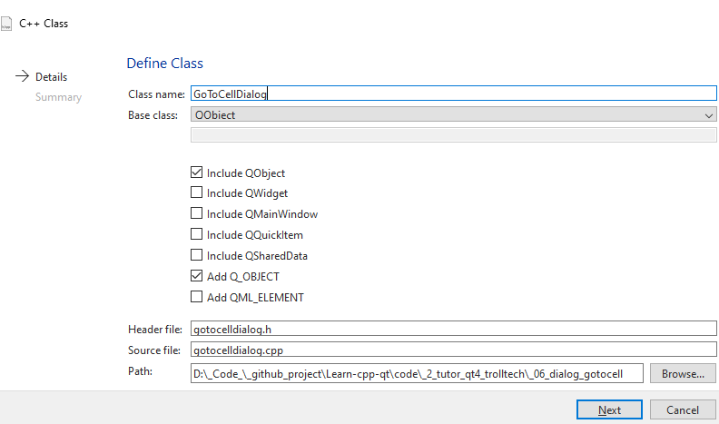

Continue after create [UI](./_06_ui_designer.md), dialog now just static,
can't close when click *buttonCancel*, do nothing when type in *lineEdit* and
click *button OK*.

Need a derived class of `QDialog` with expand signal, slot and more method 
to make them active.

## Content
- [Create source code for derived class with UI base on `QDialog`](#create-source-code-for-derived-class-base-on-qdialog)

---

## Create source code for derived class base on `QDialog`

- **Right click** -> **Add new** -> **C/C++ Class** -> **C++ Class**  
    - **Class name** set *GoToCellDialog*.
    - **Base class** set *QObject*
    

- Now project has `gotocelldialog.h` and `gotocelldialog.c` with
*QObject template*.
- Next in `gotocelldialog.h` change parent class `QObject` into `QDialog`
    - Then add `ui_gotocelldialog.h` library generated from static UI `gotocelldialog.ui`, see [ui designer](./_06_ui_designer.md).
        - Add ui `Ui::GoToCellDialog *ui` into source file as a class private member.
    - header file:
    ```cpp
        #ifndef GOTOCELLDIALOG_H
        #define GOTOCELLDIALOG_H

        #include <QDialog> // old <QObject>
        #include "ui_gotocelldialog.h"

        class GoToCellDialog : public QDialog // old QObject
        {
            Q_OBJECT
        public:
            explicit GoToCellDialog(QDialog *parent = nullptr);
            ~GoToCellDialog();  // add destructor help delete *ui memory
        
        private slots:
            void on_lineEdit_textChanged();
        private:
            Ui::GoToCellDialog *ui;

        signals:
        };

        #endif // GOTOCELLDIALOG_H
    ```
    - source file:
    ```cpp
        #include "gotocelldialog.h"

        #include <QRegularExpression>
        #include <QRegularExpressionValidator>

        GoToCellDialog::GoToCellDialog(QDialog *parent) // old QObject 
            : QDialog{parent}, // old QObject           // Initializer list at pre-constructor 
            , ui(new Ui::GoToCellDialog)        // - allocate/initial memory for ui
        {
            ui->setupUi(this);  // set designed ui for this derived Dialog class


            // add validator with regular expression for lineEdit
            QRegularExpression regExp("[A-Za-z][1-9][0-9]{0,2}");
                // create validator, set this Dialog is parent
                // then it auto delete after parent was deleted
            ui->lineEdit->setValidator(new QRegularExpressionValidator(regExp, this));

            // signal slot
                // accept() and reject() both close the dialog
                // but accept() set return QDialog::Accepted
                // the reject() set return QDialog::Rejected 
                // 
                // The return useless if start QWidget with `show()` method
                // But Dialog is window call from other MainWindow or Widget,
                //      it sometime start by `exec()` method. 
                //      This method return result corresponding to the above conditions
            connect(ui->okButton, SIGNAL(clicked()), this, SLOT(accept()));
            connect(ui->cancelButton, SIGNAL(clicked()), this, SLOT(reject()));

            connect(ui->lineEdit, SIGNAL(textChanged(const QString &)),
                this, SLOT(on_lineEdit_textChanged()));

            // fix window size
            this->setFixedHeight(this->sizeHint().height());
            this->setFixedWidth(this->sizeHint().width());
        }

        // destructor
        GoToCellDialog::~GoToCellDialog()
        {
            delete ui; ui = nullptr;
        }

        void GoToCellDialog::on_lineEdit_textChanged()
        {
            ui->okButton->setEnabled(ui->lineEdit->hasAcceptableInput());
        }
    ```
