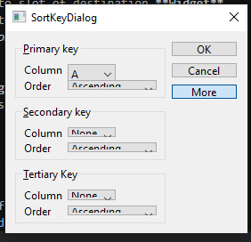
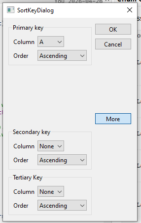

This section will creates a dialog has a toggle
button that allows the user to switch between the dialog’s simple and extended
appearances. 

*The dialog is a Sort dialog in a spreadsheet application, where the user can
select one or several columns to sort on. The dialog’s simple appearance allows
the user to enter a single sort key, and its extended appearance provides for
two extra sort keys. A More button lets the user switch between the simple and
extended appearances.*

## Content
- [Layout Widgets on Dialog](#create-source-code-for-derived-class-base-on-qdialog)
- [Different from using `setFixedHeight/Width` with `layout()`->`setSizeConstraint()`](#different-from-using-setfixedheightwidth-with-layout-setsizeconstraint)

---

## Layout Widgets on Dialog

Follow step from:
    - URL: [C++ GUI Programming with Qt 4 (1st Edition)](https://www-cs.ccny.cuny.edu/~wolberg/qt/books/C++-GUI-Programming-with-Qt-4-1st-ed.pdf)
    - From Page: 30

---

Some note when layout:
- Widget **QComboBox**:
    - In UI `Design` page, it can be double click to open **Edit ComboBox** dialog.
        - `+` `-` `^` `v` icon can be use to create and sort ComboBox items.
- Widget can adjust it size on own child Widgets:
    - right click -> **Adjust size**

- Connection signal slot:
    - Edit -> Edit Signals/Slots
    - Click on **Widget** emit signal -> connect it to slot of destination **Widget**
    - Then **Configuration Connection** window show to select connect signal-slot pair
    - Click box *Show signals and slots inherited from Qwidget* if missing expected slot or signal.

- **QGroupBox**:
    - slot **setVisible(bool)** only find in **Configuration Connection** if signal
    want connects to is has **(bool,...)** parameters

--- 

### Different from using `setFixedHeight/Width` with `layout()`->`setSizeConstraint()`
Both of them affect on **Widget** size, and make user can't resize. But has sone different.

---

1. The method `setFixedHeight` or `setFixedWidth` will fix size of the **Widget**.
    - That mean widget neverchange size if any **child Widget** change size.
    - 

1. The method `layout()`->`setSizeConstraint()` adjust and fix size for layout inside
**Widget**, that mean the **Widget** must resize follow it.
- 