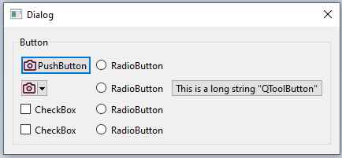
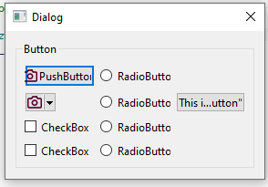

This section will test the Qt built-in *Widgets* and some *Dialog classes*.

## Content
- [Built in Widgets]()
- [Built in Dialogs]()

---

## Build-in Widgets

1. Button widgets:
- **QPushButton**: A button with string label on it
    - It can act like a toggle button or just push button
    - It support icon with text by method **setIcon()** and **setText()**
- **QToolButton**: Like a push button but has extra features:
    - Display icon, text make highlight the tool behaviors.
    - It text quite long than button, change by `...`. Example: Tool button -> To...on
    - Create a **Popup** menu with multiple option by method `setPopupMode()`.
- **QCheckBox**: A square box can tick on it
- **QRadioButton**: A Circle box can tick on it
    - radio boxs in the same scope like Widget, layout mutual exclusive others (only one box checked).

2. Container widget:
- **QFrame**
    - Same with **QWidget**, addition is has frame.
- **QGroupBox**
    - Has frame + Title
- **QToolBox** 
    - Each new page title stacked on oldpage, take amount vertical space
    - Only suitable if few page, icon ToolButton 
- **QTabWidget**
    - Like **GroupBox** but multiple pages, tab bar change page
- **QScrollArea**
    - If mainpage bigger than parent Widget, appear scroll bar
- **QStackedWidget**
    - Like **QTabWidget** but multiple pages without tab bar to change page
    - Using when custom button to change page or handle display page follow event

- ****

---

---

## Built in Dialogs