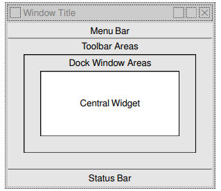

Follow project: **Spreadsheet**

---

Morden Main Window GUI provide some: *menu*s, *context menus* (right click), *toolbars*



Qt using the **actions** handle contexts inside them:
- Create and set up the actions.
- Create menus and populate them with the actions.
- Create toolbars and populate them with the actions.

---

## Content
- [Create action in MainWindow](#create-action-in-mainwindow)
    - the [New](#new-action) action.

- [Create a menu containing actions, set to menu bar](#create-a-menu-containing-actions)
    - the **menuBar()** of *QMainWindow*
    - Fix android missing menubar: https://stackoverflow.com/questions/25261760/menubar-not-showing-for-simple-qmainwindow-code-qt-creator-mac-os
- [Create a context menu when right click on QObject](#create-a-context-menu-when-right-click-on-qobject)

- [Create toolbars, set it to toolbar areas](#create-toolbars-set-it-to-toolbar-areas)

- [Setup content to status bar]()

- [Create main widget and set to the window central]()

---

## Create action in MainWindow
The term **action** is an object has some properties:

- Label and/or Icon
    - Label can include **&** to add a buddy, this optional or using shortcut below.
- A combined shortcut Key: example Ctrl + Shift + N 
- A status line help, show when hover on
    - Content will display on **status bar**
    ```txt
        From Qt Creator, click F1 on setStatusTip() method

        statusTip : QString
        This property holds the action's status tip
        The status tip is displayed on all status bars provided by the action's top-level parent widget.
        By default, this property contains an empty string.
    ```

- A **signal** when clicked can make connection.

---

### `New` action 
Properties:
- Main class is **QAction**
    ```cpp
        // Label and parent:
        newAction = new QAction(tr("&New"), this);
        newAction->setIcon(QIcon(":/images/new.png"));
        // Shortcut
        newAction->setShortcut(tr("Ctrl+N"));
        // Status
        newAction->setStatusTip(tr("Create a new spreadsheet file"));
        // Signal: triggered()
        connect(newAction, SIGNAL(triggered()), this, SLOT(newFile()));
    ```

---

## Create a menu containing actions
The *QMainWindow* has a **QMenuBar** can add some *QMenu Widget* inside it:
- The *QMenuBar* can access by **menuBar()**, it automatically create 
new *QMenuBar* at first call.
    - *QMenuBar* can contain some *QMenu* by **addMenu()** method (notice ownership, `F1` on this method to see documentation in Qt Creator)
    - *QMenuBar* with method **addSeparator()** add a vertical line between each *QMenu*
- The *QMenu* can contain some *Action*

Example:

```cpp
fileMenu = menuBar()->addMenu(tr("&File"));
fileMenu->addAction(newAction);
fileMenu->addAction(openAction);
fileMenu->addAction(saveAction);
fileMenu->addAction(saveAsAction);
separatorAction = fileMenu->addSeparator();
for (int i = 0; i < MaxRecentFiles; ++i)
fileMenu->addAction(recentFileActions[i]);
fileMenu->addSeparator();
fileMenu->addAction(exitAction);
```

---

## Create a context menu when right click on QObject
*Any **Qt widget** can have a list of QActions associated with it. To provide a
context menu for the application, we **add the desired actions** to the Spreadsheet
widget and set that **widget’s context menu policy** to show a context menu with
these actions. Context menus are invoked by **right-clicking** a widget or by
pressing a platform-specific key.*

```cpp
void MainWindow::createContextMenu()
{
spreadsheet->addAction(cutAction);
spreadsheet->addAction(copyAction);
spreadsheet->addAction(pasteAction);
spreadsheet->setContextMenuPolicy(Qt::ActionsContextMenu);
}
```

--- 

## Create toolbars, set it to toolbar areas

- *QMainWindow* has a *Toolbars Areas*, that mean can include multiple **QToolBar**.
- Each **QToolBar** can add action and separator.

```cpp

void MainWindow::createToolBars()
{
fileToolBar = addToolBar(tr("&File"));
fileToolBar->addAction(newAction);
fileToolBar->addAction(openAction);
fileToolBar->addAction(saveAction);
editToolBar = addToolBar(tr("&Edit"));
editToolBar->addAction(cutAction);
editToolBar->addAction(copyAction);
editToolBar->addAction(pasteAction);
editToolBar->addSeparator();
editToolBar->addAction(findAction);
editToolBar->addAction(goToCellAction);
}

```

---

## Setup content to status bar

- 

```cpp
void MainWindow::createStatusBar()
{
locationLabel = new QLabel(" W999 ");
locationLabel->setAlignment(Qt::AlignHCenter);
locationLabel->setMinimumSize(locationLabel->sizeHint());
formulaLabel = new QLabel;
formulaLabel->setIndent(3);
statusBar()->addWidget(locationLabel);
statusBar()->addWidget(formulaLabel, 1);
connect(spreadsheet, SIGNAL(currentCellChanged(int, int, int, int)),
this, SLOT(updateStatusBar()));
connect(spreadsheet, SIGNAL(modified()),
this, SLOT(spreadsheetModified()));
updateStatusBar();
}
```