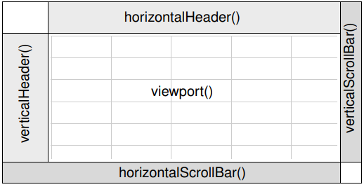

Follow project: **Spreadsheet**

- Addition soon: itemChanged() signal

## Content
- [QTableWidget area](#qtablewidget-area)
- [QTableWidget method](#qtablewidget-method)

---

## QTableWidget area
A **QTableWidget** is composed of several child widgets:

- 2 **QHeaderView** at top and left
- 2 **QScrollBars** at right and bottom

---

## QTableWidget method

- Note **itemChanged(QTableWidgetItem *)** signal

