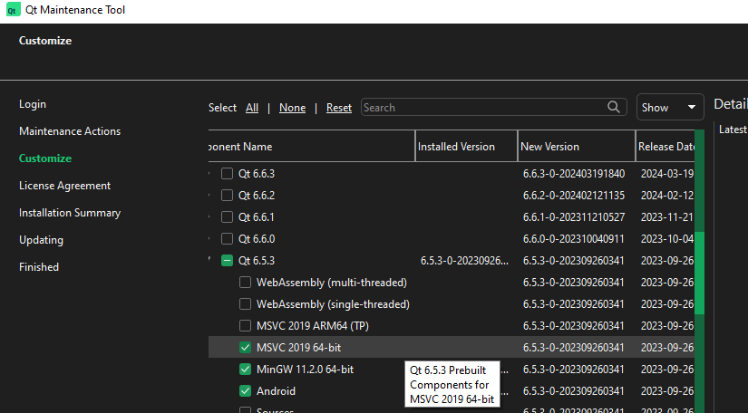
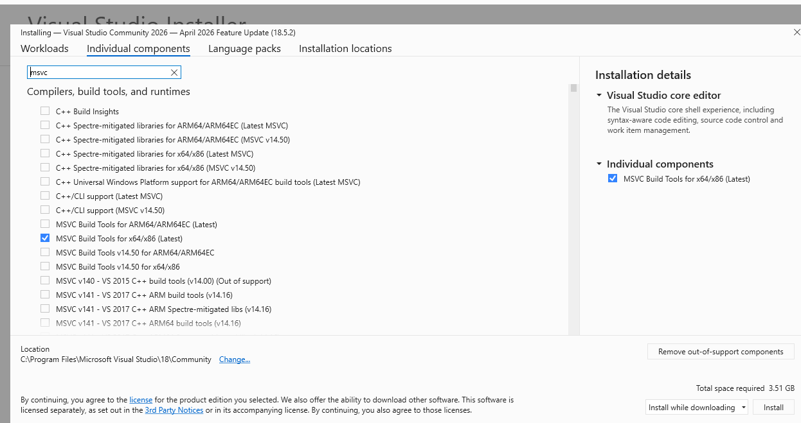
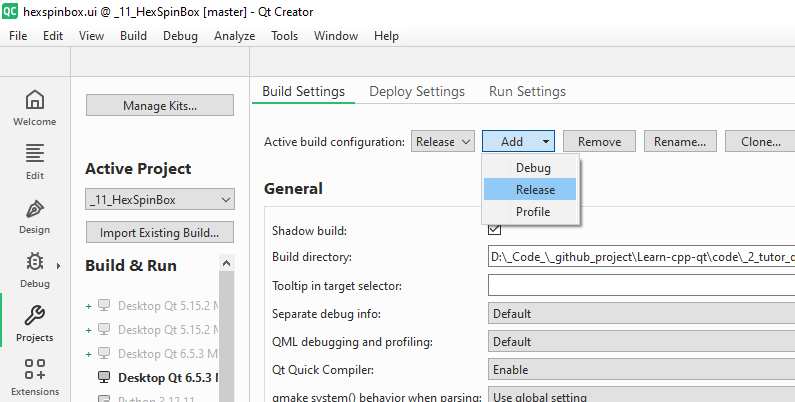
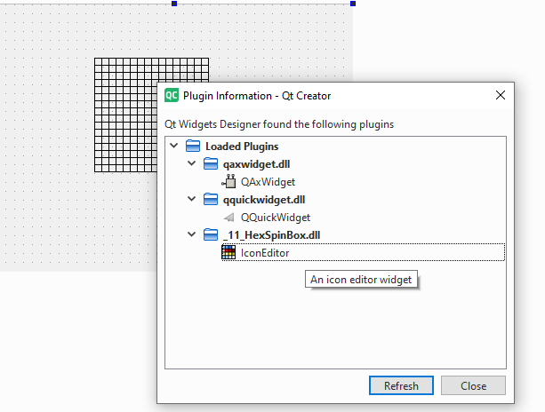

## Content
- [custom HexSpinBox](#custom-the-spinbox-hexspinbox)
- Q_PROPERTY: see code **_11_HexSpinbox** [here](../_11_HexSpinBox/)
- create an IconEditor Widget: see code **_11_HexSpinbox** [here](../_11_HexSpinBox/)

- [Add custom widget into Design mode by `Plugin`]()
    - Note before create plugin, add this module in **.pro** file: **QT += designer**
    - Add base designed wiget library into plugin library
    - Fix plugin configuration in Qt5,6 different old features in Qt4:  
    https://stackoverflow.com/questions/22394477/how-to-create-plugins-qt-5-2-0  
    https://doc.qt.io/qt-6/qdesignercustomwidgetinterface.html
    - Better create independent project to make new plugin widget, qmake need
    modify some properties for plugin, then can't build app normally:
    ```cmake
        QT += designer
        TEMPLATE = lib
        DESTDIR = $(QTDIR)/plugins/designer
    ```
    - Check plug-in if it add fail:
        - May check reason: Design page -> Tool -> Form editor
        -> About Qt Widget Designer Plugin ... 

        - If current build Kit using MinGW and Check Qt version is MSVC: 
            - Help => About Qt creator
            - Project setting: check if is MinGW
            - Fix is change Build Kit to MSVC
            - Then down load MSVC compiler C++ from Visual Studio IDE
              
            
            - Fix missing standard library for MSVC: https://forum.qt.io/topic/91057/c1083-cannot-open-include-file-stddef-h-no-such-file-or-directory/15
                - Just download Window SDK for desktop in Visual Studio IDE
            - Fix incompatitive debug and release. Just build in release mode  
            
            

---

## Custom the SpinBox->HexSpinBox
Default **SpinBox** no support printf Hex format. Write a subclass **HexSpinBox**
with override some base **SpinBox** virtual method:
- First define new **QRegularExpressionValidator** to handle string user input.
    ```cpp
            // limit range by set rule QRegularExpression : accept 0->9 a->f A->F, max 8 keyword
            // return QValidator::State include:
            //      - Invalid: Block continue typing, need delete laster keyword or maximum input
            //      - Intermediate: Allow input but value not yet completed
            //      - Acceptable: Available value
        validator = new QRegularExpressionValidator(QRegularExpression("[0-9A-Fa-f]{1,8}"), this); 
    ```
- validate() inside need a validator handle input regular expresstion
- textFromValue() will be called after user done input string. Then compare return int value with range from **setRange(0, 1023)** before
- valueFromText() will be called after check range then print string return into Spin box

--- 

## Create an IconEditor Widget
