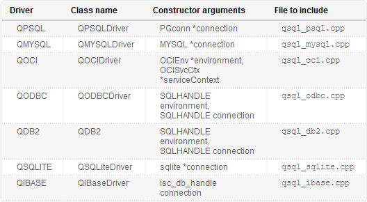

## Content

- [Connect and querying](#connect-and-querying)
    - [Connect to database](#1-using-qsqldatabase)
    - [Query](#2-quering-with-sqlquery)

    ```text
        // short cut work flow with sql:
        
        // 1. make connection
        - addDatabase : register a global connection, set a SQL driver to target database.
        - setDatabaseName : identify to data base, such as: data base name, link to local database
        - (optional) setUserName : username
        - (optional) setPassword : password
        - (optional) setHostName : server url, dns
        - (optional) setPort : server port
        - (optional) setConnectOptions
        - open() : start make connection

        // 2. make query
        - QSqlQuery query(db) : the connection db now is refered by 'query'
        - query.prepare("...") and query.bindValue("...", ...) : prepare query

        - (optional) db.transaction();

        - query.exec() : start query
        - query.isActive() : check if query is active (or connection problem)
        - query.next() : move to first row, then repeat to read next row.
        - query.value(0).toInt() : read column 0 of current row, convert to Int

        - (optional) db.commit(); // if transaction used

        // 3. clean after use
        - (query) make all queries out of range, or delete if dynamic object
        - (db) close()
        - (db) removeDatabase: remove connection from Qt global pool
    ```

---

### Connect and querying

Before execute SQL queries, connect with database.



### 1. Using **QSqlDatabase**
1. *QSqlDatabase::addDatabase("QMYSQL",  "conn1")*: 
    - Create a QSqlDatabase object
    - First parameter will select which database driver connect with database.
        - *"QMYSQL"* means using MySQL.
    - Second parameter is *connection name*.
        - Driver allows access database with multiple connections, distinguish by *connection name*
        - The connection "conn1" is a **global name**
            - After add success, *QSqlDatabase* for this connection can be retrieved by
            ***database**("conn1")*
        - Warning, the **connection name** is unique, and if another new register
        it will reuse with new database information.
            - Then access may not consistant if another/old logic is using this *name*.
    - The main purpose of *connection name* is thread safe.
        - Each thread should take independent connection with other threads.
        - Or user must guarantee avoid race conditions.
    - After no longer use this connection can remove by **removeDatabase()**  
        - But make sure all references to this connection were ended first
            - All queries on this connection must out of scope or exactly deleted.
            - Then close connection **QSqlDatabase::close()**
1. *setDatabaseName("musicdb")*
    - Sets the database name
    - Must set database name before **open()**
        - Or must **close()** first
    - With *QSQLITE*, this is link to database.
1. *setUserName("username")*
    - username while login, or ignore it
1. *setPassword("password")*
    - password while login, or ignore it
1. *setHostName("")*
    - server ip, server DNS, or empty, ignore it
1. *setPort(80)*
    - server port, or ignore it
1. *setConnectOptions()*
    - optional, or ignore it

---

1. Finally, *open()* 
    - if *false*, can handle raise a message box as user continue or not.
    - Then, *close()* if no longer use this connection.

---

### 2. Quering with SqlQuery

```cpp
    // create data base connection
    // QSqlDatabase db = QSqlDatabase::addDatabase("QMYSQL",  "conn1");
        // ...
    
    // if database connection created before, just retrieve by
    QSqlDatabase db = database("conn1");

    db.open();

    // query
    QSqlQuery query(db);

    ... // see the Content section at top of this file 
```